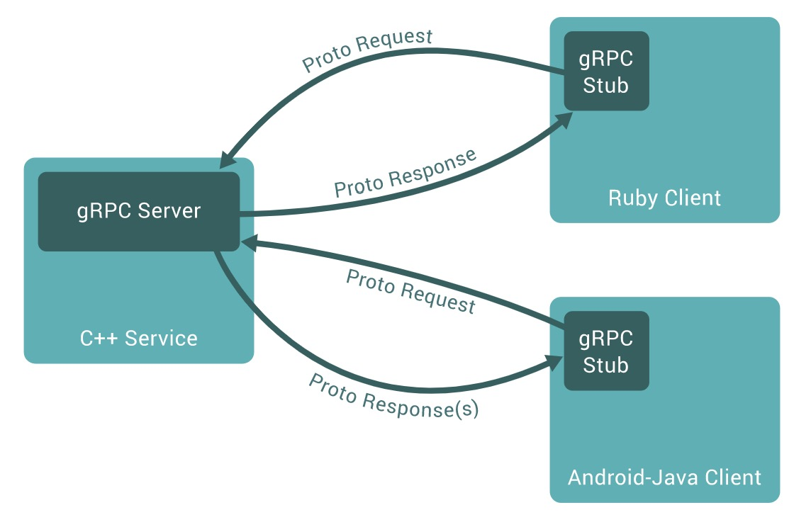

# 介绍

在gRPC中，客户端应用程序，可以直接调用，在另一台机器上的，服务器应用程序上的方法，就好像它是本地对象一样，这使你更容易创建分布式应用程序和服务。



与许多RPC系统一样，gRPC基于定义service的想法，指定可以用参数和返回类型，远程调用的方法。 在服务器端，服务器实现此接口，并运行gRPC服务器来处理客户端调用。在客户端，客户端有一个存根（在某些语言中被称为客户端），它提供与服务器相同的方法。

默认情况，gRPC使用protocol buffers。

使用protocol buffers的第一步，是为要在proto文件中序列化的数据定义结构：这是一个带.proto扩展名的普通文本文件。 Protocol buffer数据被构造为messages，其中每条messages都是包含一系列称为字段的 name-value对的信息。这里有一个简单的例子：

```c
message Person {
  string name = 1;
  int32 id = 2;
  bool has_ponycopter = 3;
}
```

然后，一旦指定了数据结构，就可以使用protocol buffer编译器`protoc`，从proto定义中以你的首选语言生成数据访问类。 它为每个字段提供了简单的访问器（如`name（）`和`set_name（）`），以及将整个结构序列化为raw bytes，和从raw bytes反序列为结构的方法。 - 例如，如果选择的语言是C++，则运行编译器上面的例子，将生成一个名为Person的类。 然后，可以在你的应用程序中使用此类来填充，序列化并检索Person protocol buffer messages。

gRPC的使用，是在普通proto文件中定义gRPC services，定义PRC方法参数，和返回的类型，作为protocol buffer messages。

```c
// The greeter service definition.
service Greeter {
  // Sends a greeting
  rpc SayHello (HelloRequest) returns (HelloReply) {}
}

// The request message containing the user's name.
message HelloRequest {
  string name = 1;
}

// The response message containing the greetings
message HelloReply {
  string message = 1;
}
```
gRPC 也使用了 `protoc` 作为一个特殊 gRPC 插件，来从 proto 文件生成代码。同时生成 gRPC client端和server端代码，及protocol buffer 代码。

# 重要概念

## Service定义
像许多RPC系统一样，gRPC基于定义service的想法，指定可以通过参数和返回类型远程调用的方法。默认情况下，gRPC使用protocol buffers作为接口定义语言（IDL）来描述service接口和消息的结构。 如果需要，可以使用其他替代方案。

```c
service HelloService {
  rpc SayHello (HelloRequest) returns (HelloResponse);
}

message HelloRequest {
  string greeting = 1;
}

message HelloResponse {
  string reply = 1;
```

gRPC 让你可以定义四种类型的 service 方法:

* Unary RPCs， client发送一个单独的request到server端，返回一个单独的 response, 就像一个普通的函数调用。

```c
rpc SayHello(HelloRequest) returns (HelloResponse){
}
```

* Server streaming RPCs，client发送一个request到server端，得到一个 stream，从stream中读取返回的一系列messages。client从返回的stream 读数据，直到没有更多的messages了。

```c
rpc LotsOfReplies(HelloRequest) returns (stream HelloResponse){
}
```

* Client streaming RPCs，client写一系列的messages， 把它们发送到server, 还是使用stream。一旦 client完成了写messages, 它等待server读取这些message和返回response。

```c
rpc LotsOfGreetings(stream HelloRequest) returns (HelloResponse) {
}
```

* Bidirectional streaming RPCs，两边都 使用read-write stream，发送一系列的 messages。这两个 streams 单独操作, 因此 clients 和 servers 可以以它们喜欢的顺序读和写: 例如, server 可以 在写responses之前，等待接收所有的client messages， 或者，可以读一条message ，然后 写一条 message, 或者其它的读写结合方式。 每个stream里面的message的顺序是保留的。

```c
rpc BidiHello(stream HelloRequest) returns (stream HelloResponse){
}
```

## 使用API
gRPC用户，通常在client端调用这些API，并在server端实现相应的API。

在server端，服务器实现由service声明的方法，并运行gRPC server来处理客户端的调用。 gRPC基础设施解码传入的请求，执行service methods并编码service responses。

在客户端，客户端拥有一个称为存根的局部对象（对于某些语言，一般称为客户端），它实现与service相同的方法。 然后，客户端可以在本地对象上调用这些方法，并将该调用的参数，包装在适当的protocol buffer message类型中 - gRPC将这个请求发送到服务器，并在服务器返回的protocol buffer response之后进行查找。

## 同步和异步

同步RPC调用会阻塞，直到服务器的response，与RPC期望的过程调用的抽象最接近。另一方面，网络本质上是异步的，在许多情况下，能够启动RPC而不阻塞当前线程是很有用。

大多数语言的gRPC编程界面都具有同步和异步风格。可以在每种语言的教程和参考文档中找到更多内容

# RPC life cycle

## Unary RPC（一元RPC）

先看最简单的RPC类型，客户端发送单个请求并获取单个响应。

* 客户端调用存根/客户端对象上的方法后，server会受到通知，RPC被调用了，同时传递，client端的metadata，method name和指定的截止日期。

* 然后，服务器可以立即发送自己的初始metadata（必须在任何响应之前发送），或等待client的请求消息（首先发生的是特定于应用程序的请求消息）。

* 一旦服务器获得了客户端的请求消息，它就会执行任何必要的工作来创建和产生response。然后将response（如果成功）与状态详细信息（状态码和可选状态消息），以及可选的尾随metadata，一起返回给客户端。
* 如果状态正常，则客户端将获得响应，从而完成客户端的呼叫。

其它的与此类似，不再详述。

## Deadlines/Timeouts

gRPC允许客户指定他们愿意等待RPC完成多久，然后RPC以`DEADLINE_EXCEEDED`错误终止。 在服务器端，服务器可以查询特定的RPC是否超时，或者剩下多少时间来完成RPC。

如何指定截止日期或超时时间因语言而异，例如，并非所有语言都有默认截止日期，某些语言API根据截止日期（固定时间点）工作，某些语言API在超时方面起作用 （持续时间）。


## RPC终止
在gRPC中，客户端和服务器,都对call的成功进行了独立的和本地的确定，其结论可能不匹配。例如，你可以在服务器端成功完成RPC（“我已发送所有响应！”），但在客户端失败（“响应在我的截止日期后到达！”）。 服务器也可以决定，在客户端发送所有请求之前完成，导致PRC终止。


## 取消RPC
客户端或服务器可以随时取消RPC。 取消操作会立即终止RPC，不再进行任何事情。 
注意，它不是“撤消”：取消之前所做的更改不会被回滚。


## 元数据
元数据是关于特定RPC调用的信息（例如认证细节），以键值对列表的形式出现，其中键是字符串，值通常是字符串（但可以是二进制数据）。 元数据对gRPC本身是不透明的 - 它允许客户端提供与服务器调用相关的信息，反之亦然。
对元数据的访问取决于语言。


## Channels
gRPC Channel提供到指定主机和端口上的，gRPC服务的连接，并在创建客户端存根（或某些语言中的“客户端”）时使用。 客户端可以指定Channel参数来修改gRPC的默认行为，例如打开和关闭消息压缩。 Channel具有状态，包括已连接和空闲状态。
gRPC如何处理关闭Channel取决于语言。 有些语言也允许查询Channel状态。


