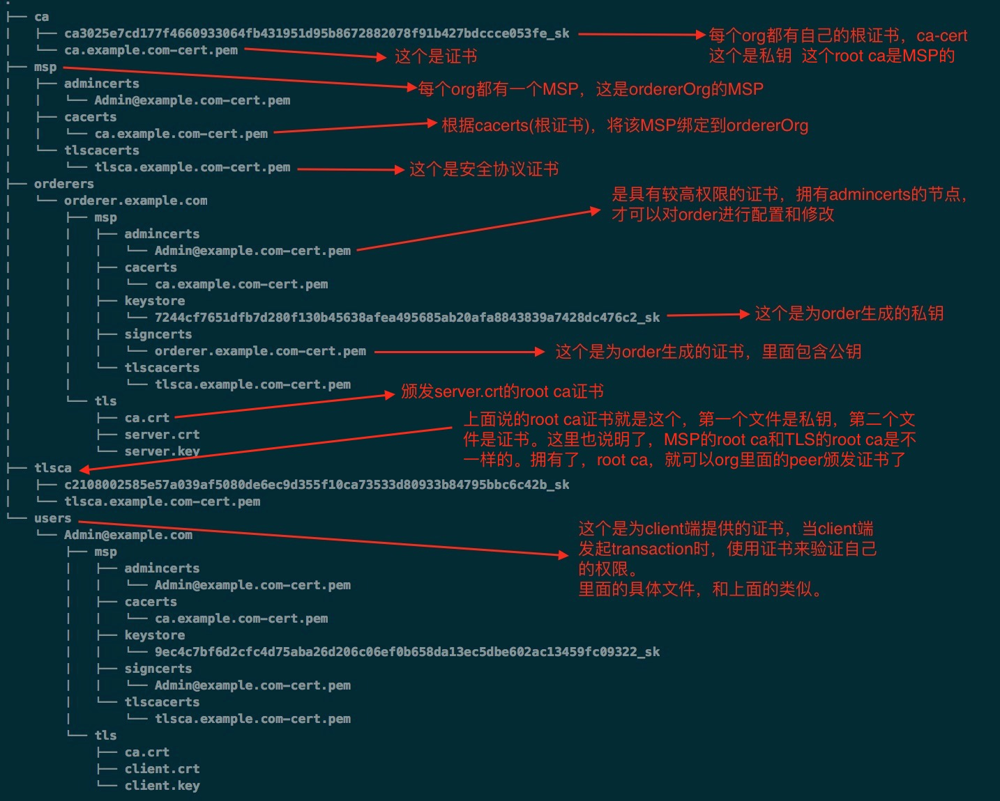
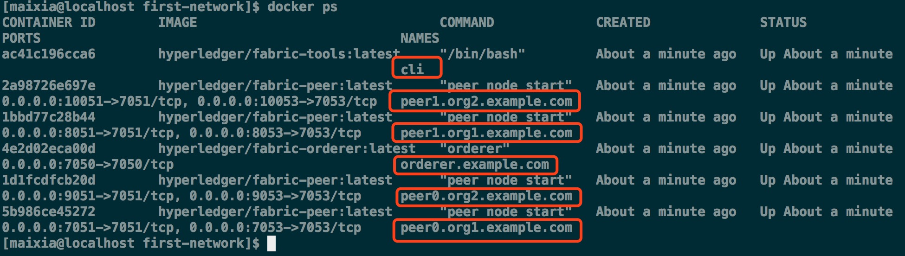

# Building Your First Network 步骤详解介绍

## build your first network (BYFN) 包含的内容

第一个Hyperledger Fabric network由下面内容组成：

*  4 个peers，代表2个不同的organizations。
*  1 个orderer 节点。
*  启动1个 container， 执行脚本，将peers加入Channel，部署和实例化Chaincode，并根据部署的Chaincode，驱动transactions的执行。

## 准备工作
1. https://github.com/xiaofateng/knowledge-without-end/blob/master/区块链/Hyperledger/Hyperledger%20Fabric%20源码和镜像下载.md
2. 修改`fabric-samples/first-network`目录下的`docker-compose-cli.yaml`日志级别为debug

```c
cli:
  container_name: cli
  image: hyperledger/fabric-tools:$IMAGE_TAG
  tty: true
  stdin_open: true
  environment:
    - GOPATH=/opt/gopath
    - CORE_VM_ENDPOINT=unix:///host/var/run/docker.sock
    - CORE_LOGGING_LEVEL=DEBUG
    #- CORE_LOGGING_LEVEL=INFO
```

## Crypto Generator

我们将使用`cryptogen`工具（这个工具只是在测试的时候使用，线上一般使用Fabric CA等）为我们的各种network entitie（网络实体）生成加密资料（x509证书和签名密钥）。 这些`certificates`（证书）是身份的代表，它们允许在我们的实体，进行通信和transact时进行签名/验证身份。

`Cryptogen`使用包含网络拓扑的文件 - `crypto-config.yaml`，并允许我们为Organizations和属于这些Organizations的组件生成一组`certificates` and `keys`（证书和密钥）。

每个Organizations都配备了一个独特的根证书（`ca-cert`），将特定的组件（peers and orderers）绑定到该Org。 通过为每个Org分配一个唯一的CA证书，我们正在模拟一个典型的网络，其中一个Member将使用自己的Certificate Authority（证书授权）。 Hyperledger Fabric中的Transactions和通信由实体的private key（私钥，存储的文件名是 `keystore`）签名，然后通过public key（公钥，存储的文件名是 `signcerts`）进行验证。

你会注意到这个文件中的 `count` 变量。我们用它来指定每个Organization的peers数量; 在我们的案例中，每个Organization有两个peers。

在运行该工具之前，让我们快速浏览一下`crypto-config.yaml`的代码片段。 特别注意OrdererOrgs header下的`“Name”`, `“Domain”` 和 `“Specs”`：

```c
OrdererOrgs:
#---------------------------------------------------------
# Orderer
# --------------------------------------------------------
- Name: Orderer
  Domain: example.com
  CA:
      Country: US
      Province: California
      Locality: San Francisco
  #   OrganizationalUnit: Hyperledger Fabric
  #   StreetAddress: address for org # default nil
  #   PostalCode: postalCode for org # default nil
  # ------------------------------------------------------
  # "Specs" - See PeerOrgs below for complete description
# -----------------------------------------------------
  Specs:
    - Hostname: orderer
# -------------------------------------------------------
# "PeerOrgs" - Definition of organizations managing peer nodes
 # ------------------------------------------------------
PeerOrgs:
# -----------------------------------------------------
# Org1
# ----------------------------------------------------
- Name: Org1
  Domain: org1.example.com
  EnableNodeOUs: true
```

网络实体的命名约定如下 -  `“{{.Hostname}}.{{.Domain}}”`。 因此，使用我们的ordering node作为参考点，我们看到一个名为 - `orderer.example.com`的ordering node，它与`Orderer`的`MSP ID`绑定。 

运行`cryptogen`工具后，生成的证书和密钥将被保存到名为`crypto-config`的文件夹中。

### 执行`cryptogen`命令

下面执行命令(假设当前路径是`hyperledger/fabric-samples/first-network`)：

`../../bin/cryptogen generate --config=./crypto-config.yaml`


执行命令后，为各个节点生成的证书如下：

`hyperledger/fabric-samples/first-network/crypto-config`目录的层级结构如下：


目录`/hyperledger/fabric-samples/first-network/crypto-config/ordererOrganizations/example.com`的详细结构如下：



peerOrganizations目录的内容与上面类似。


## Configuration Transaction Generator
	
`configtxgen tool` 创建4个配置artifacts：

* orderer `genesis block`
* channel `configuration transaction`
* 两个 `anchor peer transactions`，每个Org一个。

orderer block是ordering service的创世区块。

在 Channel 创建的时候，channel configuration transaction 文件广播到 orderer（因为orderer负责创建Channel）。

anchor peer transactions, 指定在这个Channel上，每个Org的Anchor Peer on this channel。

`Configtxgen`工具使用 - `configtx.yaml`文件 - 它包含示例网络的定义信息。 **有三个成员 - 一个`Orderer Org`（OrdererOrg，Orderer也是一个专门的org）和两个`Peer Orgs`（`Org1`＆`Org2`），**每个管理和维护两个peer节点。 **该文件还指定了由两个Peer Orgs组成的联盟 - `SampleConsortium`。（联盟是org组成的）**

 请特别注意本文件顶部的`“Profiles”`部分。 你会注意到我们有两个独特的headers。 一个用于orderer genesis block - `TwoOrgsOrdererGenesis` 。一个用于我们的Channel - `TwoOrgsChannel`。

这些headers非常重要，因为我们将在创建artifacts时将它们作为参数传递给它们。

请注意，我们的`SampleConsortium`在system-level profile中定义，然后由我们的channel-level profile引用。 channel存在于一个联盟的范围内，所有联盟必须在整个网络范围内进行界定。


该文件还包含两个值得注意的附加规范。 首先，我们为每个Peer Org指定Anchor peers（`peer0.org1.example.com`＆`peer0.org2.example.com`）。 其次，我们指向每个成员的MSP目录的位置，这反过来又允许我们将每个组织的根证书存储在`orderer genesis block`。 这是一个重要的概念。 现在任何与`ordering service`通信的网络实体都可以验证其数字签名。

### 执行`configtxgen`命令生成`orderer genesis block`

首先指定`configtx.yaml`文件的位置，目前好像不支持在命令中指定。
`export FABRIC_CFG_PATH=$PWD`

然后执行命令：

```c
../../bin/configtxgen -profile TwoOrgsOrdererGenesis -outputBlock ./channel-artifacts/genesis.block
```

生成的`orderer genesis block`存储在了`./channel-artifacts/`目录下。

### 执行`configtxgen`命令创建`Channel Configuration Transaction`

#### 创建 `channel.tx artifact`

首先设置CHANNEL_NAME变量，或者在命令中指定
`export CHANNEL_NAME=mychannel`

然后执行命令：

```c
../../bin/configtxgen -profile TwoOrgsChannel -outputCreateChannelTx ./channel-artifacts/channel.tx -channelID $CHANNEL_NAME
```

channel.tx artifact 包含了我们sample channel的定义。
生成的 `channel.tx` 在`./channel-artifacts`目录下面。

#### 指定Anchor peer

`export CHANNEL_NAME=mychannel`

为 Org1 指定 Anchor peer

```c
../../bin/configtxgen -profile TwoOrgsChannel -outputAnchorPeersUpdate ./channel-artifacts/Org1MSPanchors.tx -channelID $CHANNEL_NAME -asOrg Org1MSP
```

为 Org2 指定 Anchor peer

```c
../../bin/configtxgen -profile TwoOrgsChannel -outputAnchorPeersUpdate ./channel-artifacts/Org2MSPanchors.tx -channelID $CHANNEL_NAME -asOrg Org2MSP
```

最终channel-artifacts目录文件内容如下：


## Start the network（启动网络）

我们将使用脚本启动我们的网络。
docker-compose 文件引用了 我们之前下载的images,
并且使用之前生成的`genesis.block`， bootstraps（自举启动）orderer。

首先，启动网络的命令:
`docker-compose -f docker-compose-cli.yaml up -d`

如果想要查看网络的实时日志，就不要使用 -d 选项。

启动后，会有6个 docker containers，如下图：



CLI container 会坚持闲置1000秒，当它没有后，可以通过下面的命令重启：
`docker start cli`


## 环境变量

下文中的，为了`peer0.org1.example.com`的`CLI`命令正常使用，需要先定义下面给出的四个环境变量。 
这些用于`peer0.org1.example.com`的变量，已经被嵌入到`CLI`容器中。因此我们可以在不传递它们的情况下进行操作。

但是，如果您想将发出调用给其它peers 或 the orderer，则需要相应地提供这些值。 
检查`docker-compose-base.yaml`：

```c
# Environment variables for PEER0
CORE_PEER_MSPCONFIGPATH=/opt/gopath/src/github.com/hyperledger/fabric/peer/crypto/peerOrganizations/org1.example.com/users/Admin@org1.example.com/msp
CORE_PEER_ADDRESS=peer0.org1.example.com:7051
CORE_PEER_LOCALMSPID="Org1MSP"
CORE_PEER_TLS_ROOTCERT_FILE=/opt/gopath/src/github.com/hyperledger/fabric/peer/crypto/peerOrganizations/org1.example.com/peers/peer0.org1.example.com/tls/ca.crt
```

## 创建和加入Channel

前面，我们在 Create a Channel Configuration Transaction 部分，使用 `configtxgen`工具创建了channel configuration transaction。 你可以重复该过程以创建其它channel configuration transaction，（使用相同或不同的`configtx.yaml`配置文件）。 然后，可以重复本节中定义的流程，在网络中建立其它Channel。

我们将使用docker exec命令进入CLI容器：
`docker exec -it cli bash`

如果成功，您应该看到以下内容：
`root@0d78bb69300d:/opt/gopath/src/github.com/hyperledger/fabric/peer#`

接下来，我们把，在Create a Channel Configuration Transaction部分中，创建的channel configuration transaction artifact（我们称之为`channel.tx`），作为创建Channel请求的一部分，传递给`orderer`。

我们用`-c`指定我们的channel名称，用`-f`指定我们的channel configuration transaction。 本文中，它是channel.tx，但是您可以使用不同的名称来挂载自己的configuration transaction。 我们将再次在`CLI`容器中设置`CHANNEL_NAME`环境变量，以便我们不必显式传递此参数：

```c
export CHANNEL_NAME=mychannel
# channel.tx 文件，挂载在你的CLI container的channel-artifacts目录中。
# 为了确认 TLS handshake ，我们也传递了 orderer ca-cert 的路径。

peer channel create -o orderer.example.com:7050 -c $CHANNEL_NAME -f ./channel-artifacts/channel.tx --tls --cafile /opt/gopath/src/github.com/hyperledger/fabric/peer/crypto/ordererOrganizations/example.com/orderers/orderer.example.com/msp/tlscacerts/tlsca.example.com-cert.pem
```
注意命令中的 -- cafile 参数。它是orderer’s root cert的local path, 允许验证 TLS handshake。


这个命令返回一个genesis block - `<channel-ID.block>` - 我们将用它来加入该Channel。 它包含在channel.tx中指定的配置信息。如果您未修改默认Channel名字，那么该命令将返回一个标题为`mychannel.block`的原型。


现在，让我们把 `peer0.org1.example.com` 加入到 channel中。

```c
 peer channel join -b mychannel.block
```

如果要把`peer0.org2.example.com`加入到Channel中，记得把上面的环境变量作相应的修改。然后执行执行同样命令即可：

```c
CORE_PEER_MSPCONFIGPATH=/opt/gopath/src/github.com/hyperledger/fabric/peer/crypto/peerOrganizations/org2.example.com/users/Admin@org2.example.com/msp CORE_PEER_ADDRESS=peer0.org2.example.com:7051 CORE_PEER_LOCALMSPID="Org2MSP" CORE_PEER_TLS_ROOTCERT_FILE=/opt/gopath/src/github.com/hyperledger/fabric/peer/crypto/peerOrganizations/org2.example.com/peers/peer0.org2.example.com/tls/ca.crt 
peer channel join -b mychannel.block
```

## 更新anchor peers

以下命令是Channel更新，它们将传播到Channel的定义。**实质上，我们在channel’s genesis block的顶部添加额外的配置信息。请注意，我们没有修改生成块，而只是将 delta（增量） 添加到，定义anchor peers的链中。**

更新Channel定义以将`Org1`的anchor peer定义为`peer0.org1.example.com`：(与Channel create命令基本一样，只是把create 变为 update)

```c
peer channel update -o orderer.example.com:7050 -c $CHANNEL_NAME -f ./channel-artifacts/Org1MSPanchors.tx --tls --cafile /opt/gopath/src/github.com/hyperledger/fabric/peer/crypto/ordererOrganizations/example.com/orderers/orderer.example.com/msp/tlscacerts/tlsca.example.com-cert.pem
```

现在更新，将Org2的anchor peer定义为`peer0.org2.example.com`。
与Org1 peer的peer channel join命令一样，我们需要设置适当的环境变量。

```c
CORE_PEER_MSPCONFIGPATH=/opt/gopath/src/github.com/hyperledger/fabric/peer/crypto/peerOrganizations/org2.example.com/users/Admin@org2.example.com/msp CORE_PEER_ADDRESS=peer0.org2.example.com:7051 CORE_PEER_LOCALMSPID="Org2MSP" CORE_PEER_TLS_ROOTCERT_FILE=/opt/gopath/src/github.com/hyperledger/fabric/peer/crypto/peerOrganizations/org2.example.com/peers/peer0.org2.example.com/tls/ca.crt 
peer channel update -o orderer.example.com:7050 -c $CHANNEL_NAME -f ./channel-artifacts/Org2MSPanchors.tx --tls --cafile /opt/gopath/src/github.com/hyperledger/fabric/peer/crypto/ordererOrganizations/example.com/orderers/orderer.example.com/msp/tlscacerts/tlsca.example.com-cert.pem
```

## 安装并实例化Chaincode
本文中，我们将利用一个简单的现有的Chaincode。

应用程序通过Chaincode与区块链ledger进行交互。 **因此，我们需要在每个将执行并endorse我们的transactions的peer上，安装Chaincode，然后在Channel上实例化Chaincode。**

首先，将示例Go或Node.js Chaincode安装到一个peer上。 这些命令将指定的源代码，放在peer的文件系统上。

注意,对于每个Chaincode名称和版本，只能安装一个版本的源代码（即不能安装一份代码的多个版本）。 源代码在peer的文件系统中，文件系统的上下文（或者文件名字）是Chaincode名称和版本，它是语言不可知的。 同样，实例化的Chaincode容器将反映peer上已安装的是哪个语言的源码。

#### Golang

```c
# 这个命令安装 Go chaincode
peer chaincode install -n mycc -v 1.0 -p github.com/chaincode/chaincode_example02/go/
```
#### Node.js

```c
# 这个命令安装 Node.js chaincode
# 注意，使用 -l 选项指定语言
peer chaincode install -n mycc -v 1.0 -l node -p /opt/gopath/src/github.com/chaincode/chaincode_example02/node/
```

接下来，实例化channel上的chaincode。 
这将初始化channel上的chaincode，设置chaincode的endorsement policy，**并为目标peer启动chaincode容器**。 -P参数，指定我们的policy，指定所需的transaction endorsement，以验证此chaincode。

在下面的命令中，我们将policy指定为`-P“OR”（'Org0MSP.peer'，'Org1MSP.peer'）“`。
这意味着我们需要来自属于Org1或Org2的peer的“endorsement（认可）”。 
如果我们将语法更改为AND，那么我们需要两个都认可。

#### Golang

```c
peer chaincode instantiate -o orderer.example.com:7050 --tls --cafile /opt/gopath/src/github.com/hyperledger/fabric/peer/crypto/ordererOrganizations/example.com/orderers/orderer.example.com/msp/tlscacerts/tlsca.example.com-cert.pem -C $CHANNEL_NAME -n mycc -v 1.0 -c '{"Args":["init","a", "100", "b","200"]}' -P "OR ('Org1MSP.peer','Org2MSP.peer')"
```
#### Node.js

注意，Node.js chaincode 的实例化会花费一些时间。命令并没有挂起; 而是在编译镜像时候，安装fabric-shim layer。

```c
peer chaincode instantiate -o orderer.example.com:7050 --tls --cafile /opt/gopath/src/github.com/hyperledger/fabric/peer/crypto/ordererOrganizations/example.com/orderers/orderer.example.com/msp/tlscacerts/tlsca.example.com-cert.pem -C $CHANNEL_NAME -n mycc -l node -v 1.0 -c '{"Args":["init","a", "100", "b","200"]}' -P "OR ('Org1MSP.peer','Org2MSP.peer')"
```

## Query

下面查询一下数据，确保 chaincode 实例化成功了，state DB 里面也产生数据了。语法如下:

```c
peer chaincode query -C $CHANNEL_NAME -n mycc -c '{"Args":["query","a"]}'
```
## Invoke
现在，从 a 向 b 转账10元。 这个 transaction will cut a new block 并更新 state DB。语法如下：

```c
peer chaincode invoke -o orderer.example.com:7050  --tls --cafile /opt/gopath/src/github.com/hyperledger/fabric/peer/crypto/ordererOrganizations/example.com/orderers/orderer.example.com/msp/tlscacerts/tlsca.example.com-cert.pem  -C $CHANNEL_NAME -n mycc -c '{"Args":["invoke","a","b","10"]}'
```
再次查询，看转账是否成功：

```c
peer chaincode query -C $CHANNEL_NAME -n mycc -c '{"Args":["query","a"]}'
```
## 总结
上面的分部命令，都在`script.sh`中，通过如下命令执行
`./byfn.sh up`
使用下面的命令，清理网络：
 `./byfn.sh down`
 
 
直到对该chaincode执行init或transaction - 读取/写入（例如，查询“a”的值），chaincode container才会在peer上被启动。 

查看 CLI Docker container 日志命令：
`docker logs -f cli`

查看chaincode日志命令，需要单独查看每个 chaincode container ：

```c
docker logs dev-peer0.org2.example.com-mycc-1.0

下面是返回的具体日志:
04:30:45.947 [BCCSP_FACTORY] DEBU : Initialize BCCSP [SW]
ex02 Init
Aval = 100, Bval = 200
```


